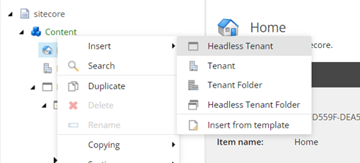
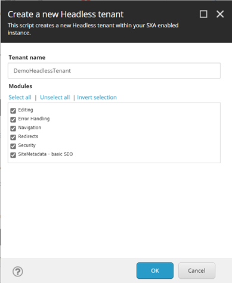
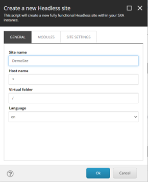
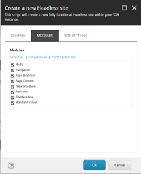
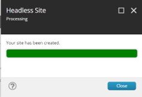
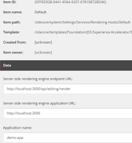
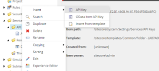
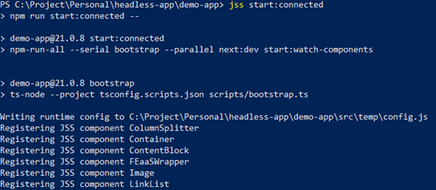
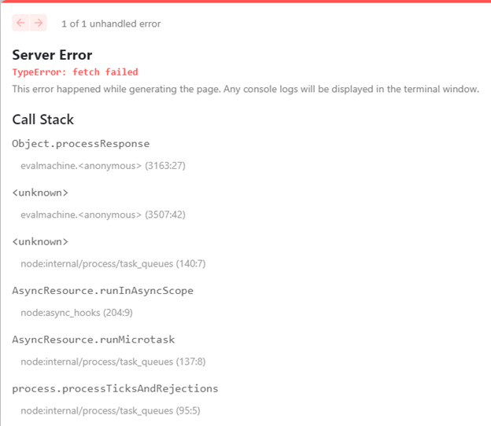
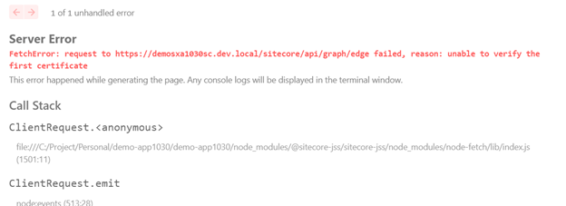

---


Photo by panumas nikhomkhai: https://www.pexels.com/@cookiecutter/ 
  


## Introduction
With the release of Sitecore 10.3, Sitecore also released a headless version of the existing SXA framework. This is based on the existing Sitecore headless framework namely JSS. But the process of deploying a headless SXA site is different from the normal JSS solution. In this article, we will deal with the deployment of a headless SXA site to Sitecore 10.3.


### Prerequisite
You should have. 
- Installed <b>Sitecore 10.3</b> with <b>Sitecore PowerShell Extensions</b> and <b>SXA</b> either using Sitecore Install Assistant (SIA) or PowerShell. You can download SIA from [here](https://sitecoredev.azureedge.net/~/media/8F77892C62CB4DC698CB7688E5B6E0D7.ashx?date=20221130T160548).
- Installed latest <b>NodeJS</b> version. My node version was 18.14.2
-	Installed <b>Sitecore Headless Rendering</b> 21.0.0 from [here](https://sitecoredev.azureedge.net/~/media/41619E7443374CA2B64A16FC53306B6C.ashx?date=20221102T124959).

### Setting up Headless Site
-	Open the Sitecore Content Editor and right click on the <b>Content Node</b>, you will see an insert option for a Headless Tenant. Please create a new <b>Headless Tenant</b>.



- After clicking insert new Headless Tenant, a new popup will appear. Please enter a name for the Tenant and select all the modules if unselected. After clicking <b>Ok</b>, it will take some time and create a new Headless Tenant. 



- After creating a new Headless Tenant, we need to create a new Headless Site. For creating the new Headless Site, please right click on the recently created Headless Tenant and insert a new <b>Headless Site</b>.


- After clicking insert Headless Site, a pop-up will appear. In the <b>General Tab</b>, please enter the new Site Name and keep all the existing settings same. 



- After that, go to <b>Modules tab</b> and click on the Select All and click on the Ok. We don’t need to make any changes in the Site Settings tab.



- It will take some time to create the Site. It will show the below pop-up after creation.



- After your Site is created, you will see a new site node in the Tenant with all the created item structures like in non-headless SXA. 


### Setup Rendering Host

This is the default rendering host setting for the Headless SXA. The location of rendering host lies in Site Template in Settings node of the Site. The Default rendering host can be found on below location.


sitecore/system/Settings/Services/Rendering Hosts/Default 



Please update the values of the fields for the Default Host as below:
-	Set Server-side rendering engine endpoint URL to - http://localhost:3000/api/editing/render
-	Set Server-side rendering engine application URL to -  http://localhost:3000
-	Set Application name same as your Next.JS app name - demo-app (this is my app name)



### Create JSS API Key

We need to create an API key for our headless application. Please navigate to the below location and right click the <b>API Keys folder</b> and insert a new <b>API Key</b>.


/sitecore/system/Settings/Services/API Keys




Set the Value of <b>CORS Origin</b> and <b>Allowed Controllers</b> to <b>*</b> We will use the ID of this item as API Key in our JSS application setup later. 


### Creating JSS Application

To create the JSS Application, first we need to install the Sitecore JSS package globally. Please use the below command to install the same.


npm install -g @sitecore-jss/sitecore-jss-cli


After installing the above package, we need to create a new JSS Application with a pre-defined template. Sitecore provides 7 different base templates namely Next.js, react, angular, Vue, react-native, node-headless-ssr-experience-edge and node-headless-ssr-proxy. For this demo, I will use the Next.js template. 
You will need to install Jss and Next.js template before creating a Next.js application. Please run the below command for installing the Next.js template.


npm install -g @sitecore-jss/sitecore-jss @sitecore-jss/sitecore-jss-nextjs


After installing the Next.js template, please use the below command to create an application based on the Next.js template.


npx create-sitecore-jss --templates nextjs,nextjs-sxa --appName demo-app --hostName xp103.sc --fetchWith GraphQL

<b>Note:</b> In the above command, please change the appName and hostName as per your setup.

After running the above command, it will ask several questions, as written below:
###### Where would you like your new app created? 
It will show the default path on the right side as in screenshot below. You can simple press enter to install on the default path or can provide a new path for creating an app.


###### How would you like to prerender your application?
In this question, it will ask to choose prerendering technique whether to choose Static Site Generation (SSG) or Server Side Rendering (SSR). Please choose as per your need.


After the above question, it will start installing the npm packages and your app will be created.


### Setting up JSS Application

After creating the JSS application, you need to make few configurations. Please go to the root folder of your JSS app and run below command.


jss setup 


After running the above command, it will ask you several questions as below:
######  Is your Sitecore instance on this machine or accessible via network share?
In this question, it’s asking if Sitecore instance is installed on your machine or not. Please press y in this case.


######  Path to the Sitecore folder (e.g. c:\inetpub\wwwroot\my.siteco.re):
In this question, please provide the path of web root of your Sitecore instance.


Sitecore hostname (e.g. http://myapp.local.siteco.re; see /sitecore/config; ensure added to hosts):
In this question, please provide the hostname of your Sitecore instance.


######  Sitecore import service URL [https://sxa1030sc.dev.local/sitecore/api/jss/import]:
In this question, it will show you default url for import service based on the hostname you provided earlier. Please don’t make any changes and press enter.


######  Sitecore API Key (ID of API key item):
In this question, please enter the ID of the API Key we created earlier in Sitecore at below location.
/sitecore/system/Settings/Services/API Keys/API Key


######  Please enter your deployment secret (32+ random chars; or press enter to generate one):
In this question, please enter the 32+ random characters deployment secret for your application or you can simply press enter and it will create one for you. I simply pressed enter. This was the last step of the setup process.


After the above steps, we need to do some manual configs. Please follow the same as below

#### Set JSS Config Files
We need to remove default site need from the config file located at the below location as we are managing sites from Sitecore.


/demo-app/sitecore/config/demo-app.config



Scroll down the same file and verify the app registration urls.


In the above config, update the sitecorePath with the path of your site in the headless tenant. For the above demo, the url is below and it will look like below screenshot.


After updating the above path, please scroll down and find the config named <b> JavaScriptServices.ViewEngine.Http.JssEditingSecret </b> and uncomment the same. please go to the adjacent file (demo-app.deploysecret.config for the above demo) for deployment secret and copy the same and update in in the above config. It will look like this below.


After updating the above file, please go to the adjacent file (demo-app.deploysecret.config for the above demo) for deployment secret and copy the same. Please go to .env file at the root of the project and paste the same to <b>JSS_EDITING_SECRET</b>. Copy the API key from Sitecore and paste it to <b>SITECORE_API_KEY</b>. After the above changes, your file will look like below.


#### Setting Dictionary

Please go to /src/lib/dictionary-service-factory.ts and create a new property named <b>rootItemId</b> at the below location mentioned in the screenshot. The value of rootItemId is the ID of the Home Page of your site in Sitecore. For this particular demo, the path of item is <b>/sitecore/content/DemoHeadlessTenant/DemoSite/Home</b> and it’s ID is <b>{FAF645CE-1A7F-4059-B6FD-1D5E67486D37}</b>


#### Deploy the config

After making all the above changes, we need to deploy our changes to the Sitecore instance. Please run the below command to deploy your config changes.


 jss deploy config  



The changes will be deployed to below path at your Sitecore Instance.
<b>C:\inetpub\wwwroot\sxa1030sc.dev.local\App_Config\Include\zzz</b>

<b>Note:</b> Sometimes after deployment of config, changes are not reflected, please do an IIS Reset after the deployment and verify your changes in <b>/sitecore/admin/showconfig.aspx</b> and look for the setting named <b>JavaScriptServices.ViewEngine.Http.JssEditingSecret</b>.


### Running the App for First Time

After the deployment of the config files, our app is ready to run for the first time. Please run the below command to run the app in connected mode.


jss start:connected




After this, your app will run and you need to open <b>localhost:3000</b>(if this port is not already being used) . There you will see a blank page.


We will go to the content editor and open the Home Page in Experience Editor and will make some changes. I’ll show you my home page after changes.


### Common Errors

#### Could not resolve dependency next from @sitecore-jss/sitecore-jss-nextjs

While creating an app, this error sometimes stops npm package install. Please use the below command before doing npm install again.


npm config set legacy-peer-deps true


#### TypeError:fetch failed:



To fix this error, please run the below command before running <b>jss start:connected</b>

```Powershell
$env:NODE_TLS_REJECT_UNAUTHORIZED=0
```

#### Unable to verify the first certificate



Please follow the article with link [here](https://doc.sitecore.com/xp/en/developers/hd/21/sitecore-headless-development/walkthrough--configuring-sitecore-ca-certificates-for-node-js.html) for the above fixes.
