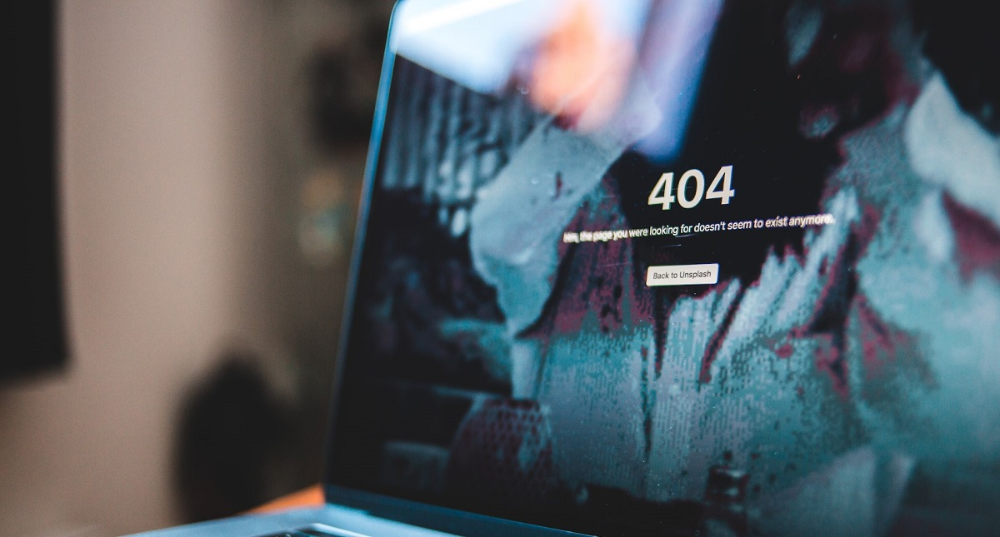
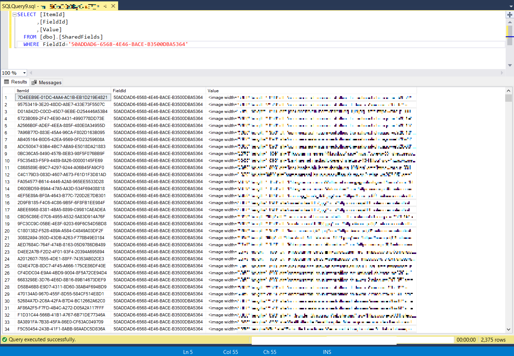

# How I corrupted the database with the 'shared' checkbox

Last week I got a request from our customer, that images should be maintainable individually for each language version. Until then, images were shared between versions. But the field came from a base template so it was only one field, that needed change.

I assumed, that shared value would simply become the value for all versions, after unchecking the "shared" flag.

"Easier done than said" I told them and I made the change ... on production.

## Cue the chaos

After some time we realized, that this had some unwanted side effects.

1. Items, that had and English and a German version had kept the value, but only for the English version
2. Items, that only had a German version had lost the value completely

Luckiliy we are able to retrieve previous backups of the database but in the meantime authors have already created new campaigns and content so I wanted to avoid a complete rollback.

## The solution

For the solution of my problems I mainly used the [Sitecore Powershell Extensions](https://doc.sitecorepowershell.com/) and [Microsoft SQL Server Management Studio](https://learn.microsoft.com/de-de/sql/ssms/download-sql-server-management-studio-ssms?view=sql-server-ver16).

### 1. Restore from English version

This issue was rather easy to fix with one PSE script:

```PS
$startPath = "master:/sitecore/content"
$infoList = [System.Collections.ArrayList]@()

$imageFieldId = "50ADDAD6-6568-4E46-BACE-B3500DBA5364}"

$itemsToProcess = Get-ChildItem $startPath -Language en -Recurseif($itemsToProcess -ne $null) {

    $itemsToProcess | ForEach-Object {

        if($_.Fields[$imageFieldId].Value) {    

          $germanItem = Get-Item -Path "master:" -ID $_.ID -Language de-DE            
          if($germanItem -ne $null -and (($germanItem.Fields[$imageFieldId].Value -eq $null) -or ($germanItem.Fields[$imageFieldId].Value -eq ""))) {
                
                $germanItem.Editing.BeginEdit()
                $germanItem.Fields[$imageFieldId].Value = $_.Fields[$imageFieldId].Value
                $germanItem.Editing.EndEdit()
                
                $info = [PSCustomObject]@{
                    "ID"=$germanItem.ID
                    "Version" = $germanItem.Version
                    "TemplateName"=$germanItem.TemplateName
                }
                
                [void]$infoList.Add($info)   
            }
        }
    }
}Write-Host "Items changed:" $infoList.Count
$infoList | Format-Table 
```

This script will retrieve the English version of the Image field for every item. If the field has a value, it is written to the German version as well.

This fixed my problem at least for all the items, that had an English version.

The next one was more of a challenge.

### Restore from database backup

Here I had some hit and miss approaches but the following ended up doing the trick.
First my awesome DevOps colleague restored an older state of the Master database, that had not suffered yet from my unthoughtful actions.

With MS SQL Server Management Studio I connected to the database and ran the following query to retrieve all values of the Image field and the ItemId, they belong to:
```SQL
SELECT [ItemId]
	  ,[FieldId]
      ,[Value]
  FROM [dbo].[SharedFields]
  WHERE FieldId='50ADDAD6-6568-4E46-BACE-B3500DBA5364'
```


Since the field was a shared field, the values were stored in the "SharedFields" table. 

With these values, I was able to write a PSE script to set the Image value again for all the items.

```PS
$import = @(
  @{ ID = '{7D4EEB9E-01DC-4AA4-AC1B-EB1D219E4821}'; Image = '<image width="3360" ...'},
  @{ ID = '{95753419-3E20-48DD-A8E7-433E73F5507C}'; Image = '<image width="3360" ...'},
  ...
)
  
$infoList = [System.Collections.ArrayList]@()

foreach($row in $import) {
    
    $item = Get-Item -Path "master:" -ID $row.ID -Language de-DE
    
    $item.Editing.BeginEdit()
    $item.Fields["{50ADDAD6-6568-4E46-BACE-B3500DBA5364}"].Value = $row.Image
    $item.Editing.EndEdit()
    
    $info = [PSCustomObject]@{
        "ID"=$item.ID
		"Path" = $item.Paths.Path
	}
    
    [void]$infoList.Add($info) 
}

Write-Host "Items changed:" $infoList.Count
$infoList | Format-Table
```

This script goes through all rows of the ItemIds and Image values, retrieves the German version of the item and then sets the value for the Image field.

And with that, all images were back in their place :)

## Conclusion

Afterall the fix was quite straightforward, but still took me almost two days to figure out all the neccessary steps. So maybe these scripts will save someone elses time in the future.

My takeaways:
1. Even one checkbox can have a severe impact.
2. Never make changes directly on PROD (who would have thought).
3. Make a backup package before you make any changes.


Photo by <a href="https://unsplash.com/@introspectivedsgn?utm_content=creditCopyText&utm_medium=referral&utm_source=unsplash">Erik Mclean</a> on <a href="https://unsplash.com/photos/black-asus-laptop-computer-showing-3-00-sxiSod0tyYQ?utm_content=creditCopyText&utm_medium=referral&utm_source=unsplash">Unsplash</a>
  