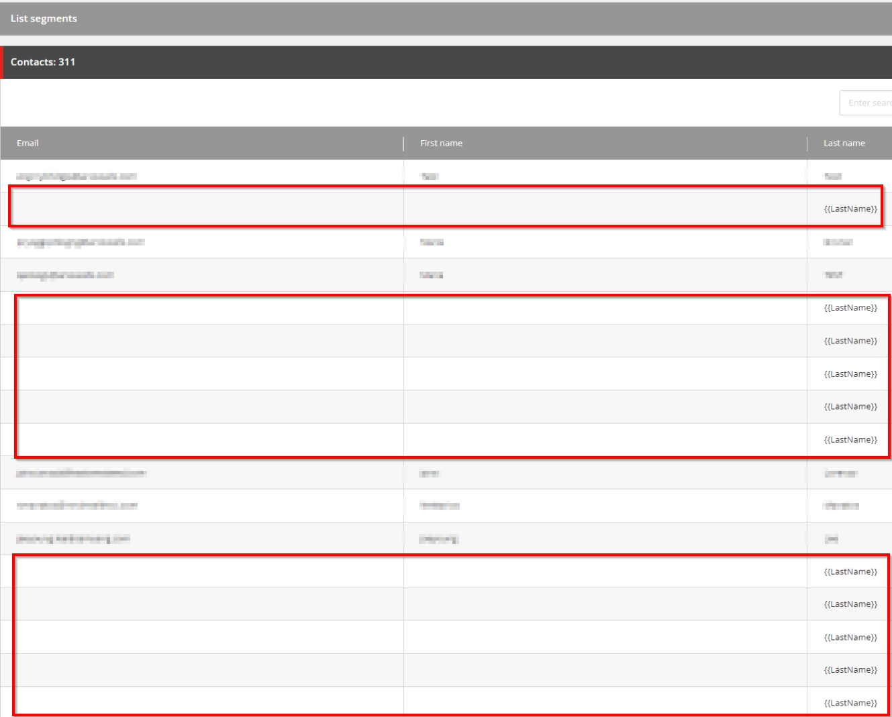
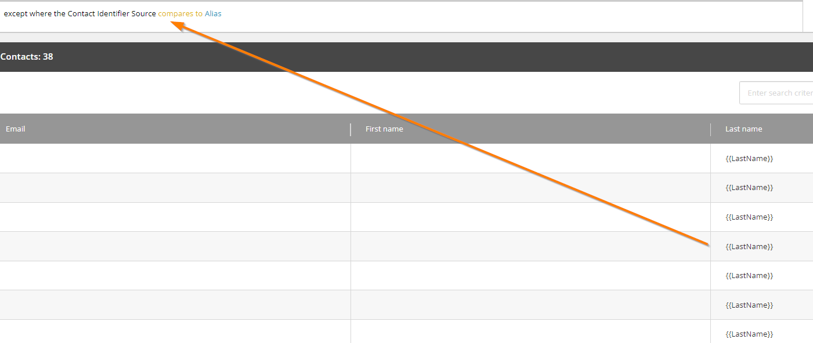

## Situation


It is how its mostly is - marketing team putted all their efforts together to send out a very important press release to over 8000 receipients at a particular time and date :e-mail: - and during the dispatch - this regular campaign type paused and was set to queued without any information or indicatior about what went wrong to the marketing team.

#### Campaign Manager


We saw the status is <b>Queuing</b>, the columns *Sent to*, *Skipped*, *Unprocessed* and *Failed* showed all a 0 so we felt lucky and thougth that was just a hickup maybe because the huge amount of contacts and we resetted the status and why tried to send it out an another time - after some 2 or 3 minutes - same issue again. :unamused:

#### Reporting mail

After some time customer provides the recieved reporting mail:


O man, there are really contacts which already recieved these mailings, but the majority not.

This all happend on a Sitecore XP 9.1.1 CM instance, what at the end of this post gets important again.

## Troubleshooting

```

10776 10:35:21 ERROR Exception: System.NullReferenceException
Message: Object reference not set to an instance of an object.
Source: Sitecore.EmailCampaign
at Sitecore.Modules.EmailCampaign.Core.Dispatch.DispatchQueueItemDataReader.GetValue(Int32 i)
at System.Data.SqlClient.SqlBulkCopy.GetValueFromSourceRow(Int32 destRowIndex, Boolean& isSqlType, Boolean& isDataFeed, Boolean& isNull)
at System.Data.SqlClient.SqlBulkCopy.ReadWriteColumnValueAsync(Int32 col)
at System.Data.SqlClient.SqlBulkCopy.CopyColumnsAsync(Int32 col, TaskCompletionSource`1 source)
at System.Data.SqlClient.SqlBulkCopy.CopyRowsAsync(Int32 rowsSoFar, Int32 totalRows, CancellationToken cts, TaskCompletionSource`1 source)
at System.Data.SqlClient.SqlBulkCopy.CopyBatchesAsyncContinued(BulkCopySimpleResultSet internalResults, String updateBulkCommandText, CancellationToken cts, TaskCompletionSource`1 source)
at System.Data.SqlClient.SqlBulkCopy.CopyBatchesAsync(BulkCopySimpleResultSet internalResults, String updateBulkCommandText, CancellationToken cts, TaskCompletionSource`1 source)
at System.Data.SqlClient.SqlBulkCopy.WriteToServerInternalRestContinuedAsync(BulkCopySimpleResultSet internalResults, CancellationToken cts, TaskCompletionSource`1 source)
at System.Data.SqlClient.SqlBulkCopy.WriteToServerInternalRestAsync(CancellationToken cts, TaskCompletionSource`1 source)
at System.Data.SqlClient.SqlBulkCopy.WriteToServerInternalAsync(CancellationToken ctoken)
at System.Data.SqlClient.SqlBulkCopy.WriteRowSourceToServerAsync(Int32 columnCount, CancellationToken ctoken)
at System.Data.SqlClient.SqlBulkCopy.WriteToServer(IDataReader reader)
at Sitecore.Modules.EmailCampaign.Core.Data.SqlDbEcmDataProvider.AddToDispatchQueue(Guid messageId, MessageType messageType, IEnumerable`1 recipients, Dictionary`2 customPersonTokens, Dictionary`2 customQueryStringParameters)
at Sitecore.EmailCampaign.Cm.Dispatch.DispatchManager.Queue(Int32 threadIndex, IEntityBatchEnumerator`1 recipients, Int32 abTestRecipients, DispatchNewsletterArgs args, Int32 enqueueBatchSize)

```

## What we found out

First we were not sure how this error message is related to the stop of the email campaign dispatch. 

NullReferenceException - what could be missing? 

We continued with our investigation and involved Sitecore Support which told us to check if we have contacts in the included lists which have a missing Alias identifier. 

So we checked all included contact list about these contacts and we found what we were looking for:



These contacts where displayed in the List Mangager without *Email*, *First Name* and *Last Name* was outputted as {{LastName}}
*Therefore, if you see such contacts in your lists please do not ignore them.*

With double-click on one of these, we entered the Experience Profile for this contact and with the contact ID we were able to check the identifiers directly in the XDB with utalizing the xdbsearch Role:


Here you can see that these contacts have no identifiers and personal information at all, how that came we still need to investigate but these seem to be very old contacts with no interactions since more then a year. :nerd_face:

## Solution
Sitecore support have advised there is no supported way to programmatically add the Alias identifier and the best option is to manually delete and recreate these contacts. But we had no time now - the mail must go out now.

So, we checked all available segmentation rules and conditions to filter against these corrupt contacts without <b>Alias</b> identifier. 



After these contacts where filtered out from the contact lists the campaing dispatch ran through and the send-out finished successfully.


#### A ray of hope - Sitecore 10
On Sitecore 10.3 this issue will not occure anymore, we found out that these contacts with no Alias identifier do not appear anymore on the segmented list. Maybe this was already a known issue and has been fixed with the upgrade.<br>
For older versions I suggest to filter these contacts out in your segmented lists + delete or recreade these contacts afterwards

From Munich with :heart:


<br>
Image from <a href="https://pixabay.com/de/users/ribkhan-380399/?utm_source=link-attribution&utm_medium=referral&utm_campaign=image&utm_content=3249062">Muhammad Ribkhan</a> on <a href="https://pixabay.com/de//?utm_source=link-attribution&utm_medium=referral&utm_campaign=image&utm_content=3249062">Pixabay</a>