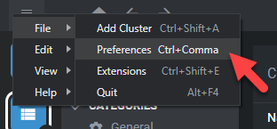
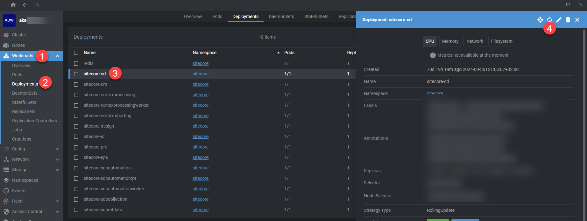

# Introduction
With a Kubernetes solution such as AKS, it is easier to scale the application according to your needs and simpler to deploy. However, troubleshooting is more difficult and requires different tools than with an app service solution.

# Tooling

## OpenLens
OpenLens is a GUI tool to manage Kubernetes clusters, without the need of extensive command line usage.

https://github.com/MuhammedKalkan/OpenLens/releases

### Pod Menu Extension 
With version 6.3.0, the Node / Pod Menu with the useful functionalities attach, shell and logs were removed from OpenLens.

To bring it back, you can add the POD Menu Extension from [this repository](https://github.com/alebcay/openlens-node-pod-menu).

## Alternatives
Currently OpenLens is the tool I use, but since the project is no longer being maintained, there are alternative open source tools that I may use in the future. They are very similar, free, open source and actively in development, here are some examples:

* [K9s](https://github.com/derailed/k9s)
* [Jet Pilot](https://github.com/unxsist/jet-pilot)
* [Seabird](https://github.com/getseabird/seabird)

## Connection to Azure
To connect an AKS Cluster from your local machine, first close your OpenLens instance, go to the [Azure Portal](https://portal.azure.com), find your **AKS Cluster (1)**, go to **Overview (2)** and press **Connect (3)**.

On the right side of the browser, a menu will open. Select Azure CLI and follow the instruction.

### Config file
Adding the cluster via Azure CLI will edit your Kubernetes config file on your machine. Usually, it's located on **C:\Users\USERNAME\.kube**

You may need to add the Kubernetes folder to OpenLens via menu, File, Preferences:

Go to Kubernetes (1), press Sync folder (2) and add the folder where the Kubeconfig file is stored C:\Users\USERNAME\.kube

## Clusters in OpenLens
After adding the clusters, in the Catalog (1) select Clusters (2) and you will see all the added clusters (3) in the overview.

## Namespace filter
When you open the Pods menu (1), and see only one pod (2), it's possible that the selected namespace (3) is not the one you want. You can op the namespace dropdown menu (4) and select the one you want.

## Basic operations

### Restart a deployment
Go to Workloads (1) - Deployments (2) select the deployment (3) you want to restart, press the restart button (4) and  confirm.

### Copy files from a container to your computer

## Copy files from your computer to a container

Photo by <a href="https://unsplash.com/@growtika?utm_content=creditCopyText&utm_medium=referral&utm_source=unsplash">Growtika</a> on <a href="https://unsplash.com/photos/a-group-of-blue-boxes-ZfVyuV8l7WU?utm_content=creditCopyText&utm_medium=referral&utm_source=unsplash">Unsplash</a>
      